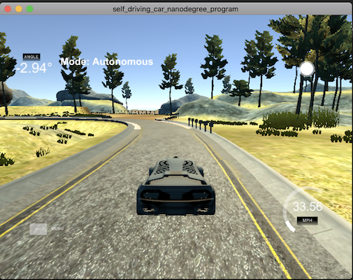
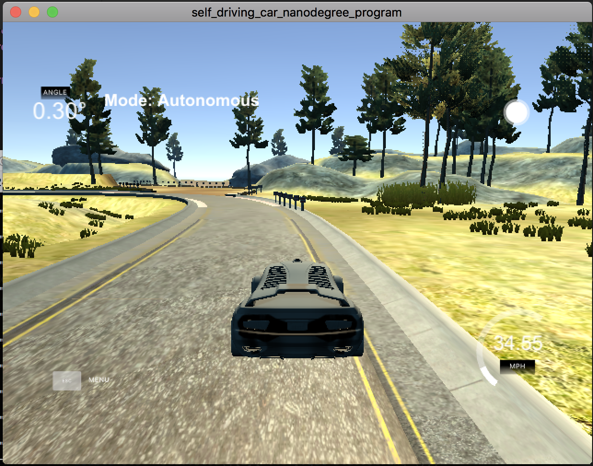

# Project Reflection

## 1. Describe the effect each of the P, I, D components had in your implementation.

P component will turn the car toward the center of the lane, I component will correct error between control input and actual output, D component will slow down the turning rate when the car is turning too fast toward the center, or speed up if the car is turning too fast away from the center line.

Here are two example of the controllers with a control error of 0.4
``` c++
msgJson["steering_angle"] = steer_value + 0.4;
```
PD controller will control the car to move in parallel along the center line:



PID controller will fix the control error over time:



## 2. Describe how the final hyperparameters were chosen.

By manually tunning with twiddle algorithm :)

It's not as easy to tune with twiddle algorithm because it's not as easy to setup evaluation function. So I run with the parameter and tell which combination of parameter is better by eye balling their performance.
